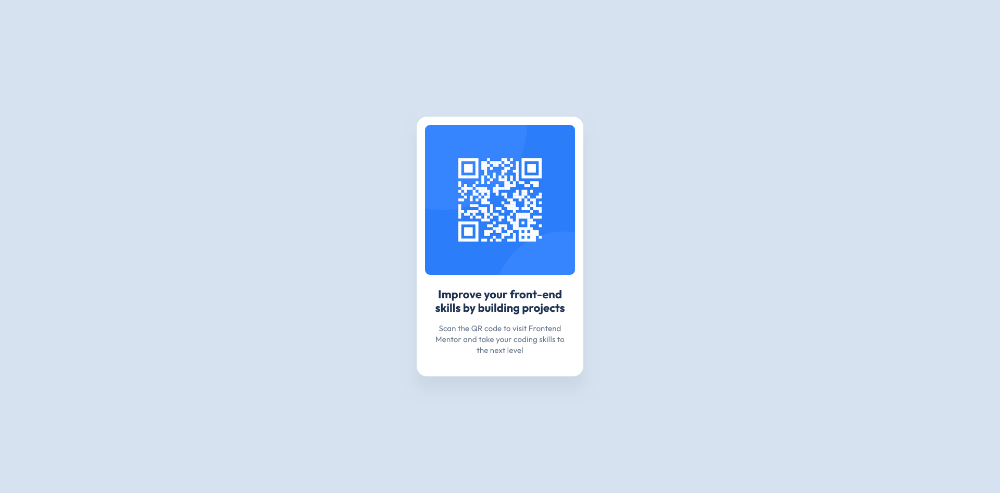

# Frontend Mentor - QR code component solution

This is a solution to the [QR code component challenge on Frontend Mentor](https://www.frontendmentor.io/challenges/qr-code-component-iux_sIO_H). Frontend Mentor challenges help you improve your coding skills by building realistic projects.

## Table of contents

- [Screenshot](#screenshot)
- [Links](#links)
- [Built with](#built-with)
- [What I learned](#what-i-learned)

### Screenshot

### Links

- Solution URL: [Solution URL](https://github.com/mohamed-fathy3010/FM-QR)
- Live Site URL: [Live site URL](https://mohamed-fathy3010.github.io/FM-QR/)

### Built with

- Semantic HTML5 markup
- CSS custom properties
- Flexbox

### What I learned

This taught me how to work with Frontend Mentor.
